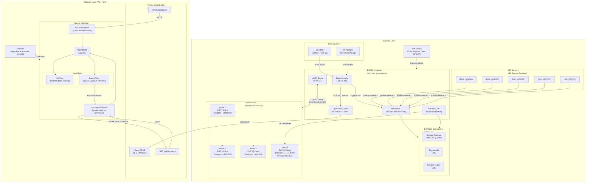

# ATM Learning System — Block Diagram

```mermaid
flowchart TD

  subgraph HARDWARE["Hardware Layer"]

    subgraph INPUTS["Input Devices"]
      COIN["Coin Slot\n(GPIO14 / Pull-up)"]
      BILL["Bill Acceptor\n(GPIO32 / Pull-up)"]
    end

    subgraph ESP32["ESP32 Controller\ncash_atm_controller.ino"]
      PULSE["Pulse Decoder\n(coin & bill)"]
      ROUTE["Bill Router\n(elevator state machine)"]
      WD["Withdraw Job\n(bill decomposition)"]
      SERIAL_OUT["USB Serial Output\nDEPOSIT: / EVENT"]
      UNO_SERIAL["UART Bridge\nGPIO16/17"]
    end

    subgraph PCA["PCA9685 Servo Driver\n(I2C 0x40)"]
      SPINNERS["Storage Spinners\nCH0–CH4 (5 slots)"]
      LIFT["Elevator Lift\nCH5"]
      EJECT["Elevator Output\nCH6"]
    end

    subgraph IR5["IR5 Sensors\n(Bill Storage Positions)"]
      IR51["IR5-1 (GPIO34)"]
      IR52["IR5-2 (GPIO33)"]
      IR53["IR5-3 (GPIO25)"]
      IR54["IR5-4 (GPIO26)"]
      IR55["IR5-5 (GPIO4)"]
    end

    IR4["IR4 Sensor\n(Coin Dispense Detect\nGPIO27)"]

    subgraph UNO["Arduino Uno\n(Motor Coprocessor)"]
      M1["Motor 1\nPHP 1 Coins\n(Stepper + ULN2003)"]
      M2["Motor 2\nPHP 5 Coins\n(Stepper + ULN2003)"]
      M3["Motor 3\nPHP 10 Coins\n(Stepper + ULN2003)"]
      M4["Motor 4\nPHP 20 Coins\n(Stepper, ESP32-direct\nGPIO18/19/23/13)"]
    end

  end

  subgraph SOFTWARE["Software Layer (PC / Host)"]

    subgraph BRIDGE["Python Serial Bridge\nserial_bridge.py"]
      SERIAL_READ["Read COM5\n@ 115200 baud"]
      HTTP_POST["POST /api/deposit"]
      HTTP_POLL["GET /api/command"]
    end

    subgraph NEXTJS["Next.js Web App\n(port 3001)"]
      API_DEP["API: /api/deposit\n(queue deposit events)"]
      API_CMD["API: /api/command\n(queue withdraw commands)"]
      DASHBOARD["Dashboard\npage.tsx"]
      subgraph ROLES["User Roles"]
        KID["Kid View\n(balance, goals, history)"]
        PARENT["Parent View\n(deposit, approve withdraw)"]
      end
    end

    BROWSER["Browser\n(any device on same network)"]

  end

  %% Input → ESP32
  COIN -->|"Pulse signal"| PULSE
  BILL -->|"Pulse signal"| PULSE

  %% ESP32 internal
  PULSE -->|"DEPOSIT amount"| SERIAL_OUT
  PULSE -->|"trigger route"| ROUTE
  ROUTE --> PCA
  WD --> PCA
  WD -->|"coin remainder"| M4

  %% IR feedback
  IR51 & IR52 & IR53 & IR54 & IR55 -->|"position feedback"| ROUTE
  IR4 -->|"dispense detect"| ESP32

  %% ESP32 ↔ Uno
  UNO_SERIAL <-->|"UART TX/RX\nDISPENSE / DONE"| UNO
  UNO --> M1 & M2 & M3

  %% ESP32 → Bridge
  SERIAL_OUT -->|"USB COM5"| SERIAL_READ

  %% Bridge ↔ Next.js
  HTTP_POST -->|"HTTP"| API_DEP
  HTTP_POLL -->|"HTTP"| API_CMD
  API_CMD -->|"WITHDRAW command"| HTTP_POLL

  %% Next.js internal
  API_DEP --> DASHBOARD
  API_CMD --> DASHBOARD
  DASHBOARD --> KID & PARENT

  %% Parent triggers withdraw
  PARENT -->|"approve withdraw"| API_CMD

  %% Browser
  BROWSER <-->|"HTTP / LAN WiFi"| NEXTJS
```
