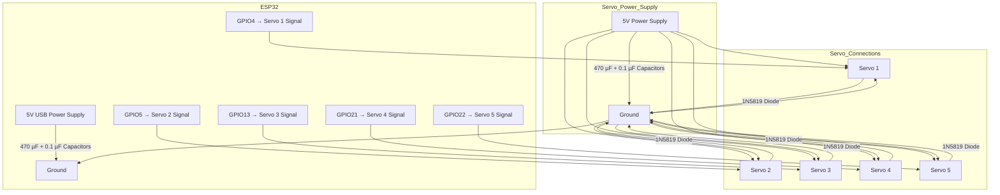

# Servo Wiring Diagram for ESP32 with Stability Components

This diagram outlines the recommended wiring setup for your ESP32-based servo control system, including additional components for improved stability and accuracy.

---

## **Wiring Diagram Description**

### **1. ESP32 Connections**
- **Power:**
  - Connect the ESP32 to a 5V USB power supply.
  - Add a **470 µF electrolytic capacitor** and a **0.1 µF ceramic capacitor** across the 5V and GND pins of the ESP32.
- **Signal Pins:**
  - Connect the servo signal wires to the designated GPIO pins on the ESP32 (e.g., GPIO4, GPIO5, GPIO13, GPIO21, GPIO22).
  - Use **twisted pair wires** for each servo (signal + ground).

### **2. Servo Connections**
- **Power Supply:**
  - Use a separate 5V power supply for the servos (e.g., Mean Well LRS-50-5, 5V 10A).
  - Connect the positive terminal of the power supply to the servo power lines.
  - Connect the ground terminal of the power supply to both the servo ground lines and the ESP32 ground.
- **Capacitors:**
  - Place a **470 µF electrolytic capacitor** and a **0.1 µF ceramic capacitor** across the power and ground lines of each servo.
- **Flyback Diodes:**
  - Add a **Schottky diode (1N5819)** across the power and ground lines of each servo to protect against back-EMF.

### **3. Grounding**
- Ensure all grounds (ESP32, servo power supply, and servo grounds) are connected together to avoid ground loops.

---

## **Diagram**

---

## **Notes**
1. Ensure all capacitors are placed as close as possible to the components they are stabilizing.
2. Use high-quality wires to minimize resistance and signal loss.
3. Double-check all connections before powering on the system to avoid damage.

---

Let me know if you need further assistance or modifications to the diagram!